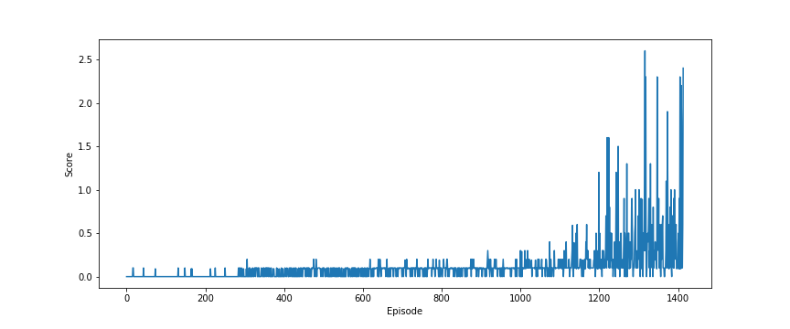

## Solve Unity Tennis environment using MADDPG

I tried multiple approaches for this environment: using a single DDPG with an observation space of 48, two DDPGs without centralized critic, and finally, DDPG with centralized critic aka MADDPG.

In order to make it work, I added some amendments to standard MADDPG:
- I use initialization episodes in the beginning, where the agent moves randomly
- Decrease the noise scale among the training steps

### Hyperparameters

- buffer_size: 1e6             # Replay buffer size
- batch_size: 256              # Minibatch size
- update_every: 15             # Steps to wait between updates
- update_batch_number: 15      # Number of batches used in one update step
- random_seed: 4               # Seed
- initialization_episodes: 10  # Number of episodes played with random agent
- agent_params:
    - gamma: 0.95              # Discount factor
    - tau: 5e-3                # For soft update of target parameters
    - lr_actor: 3e-4           # Learning rate of the actor 
    - lr_critic: 1e-3          # Learning rate of the critic
    - weight_decay: 1e-6       # L2 weight decay
- network_params:
    - actor:
        - fc1_units: 384       # Number of unit in the first layer of the actor
        - fc2_units: 256       # Number of unit in the second layer of the actor
    - critic:
        - fc1_units: 384       # Number of unit in the first layer of the critic
        - fc2_units: 256       # Number of unit in the second layer of the critic
- noise_params:
    - scale: 1.0               # Starting scale of the noise
    - mu: 0                    # Starting values of the noise
    - sigma: 0.4               # Scaler of the random term
    - theta: 0.2               # Scaler of the deterministic term
    - noise_reduction: 0.9995  # The noise is multiplied with this term after each step
    - min_noise: 0.1           # Minimum noise for the actions
    - initialization_steps: 1000  # Steps without noise reduction

During the hyperparameter search, I focused mainly on the update_every, update_batch_number and network layer sizes. The seed was also an important factor in terms of agent efficiency: the same agent with different seed can solve the environment in different episodes (1200 vs 3000).

### Rewards

I was able to solve the environment in 1414 episodes.

### Further steps

I haven't experimented with the network layer numbers, it would be interesting to try 3-layers networks. Prioritized experience replay can also be advantageous.
